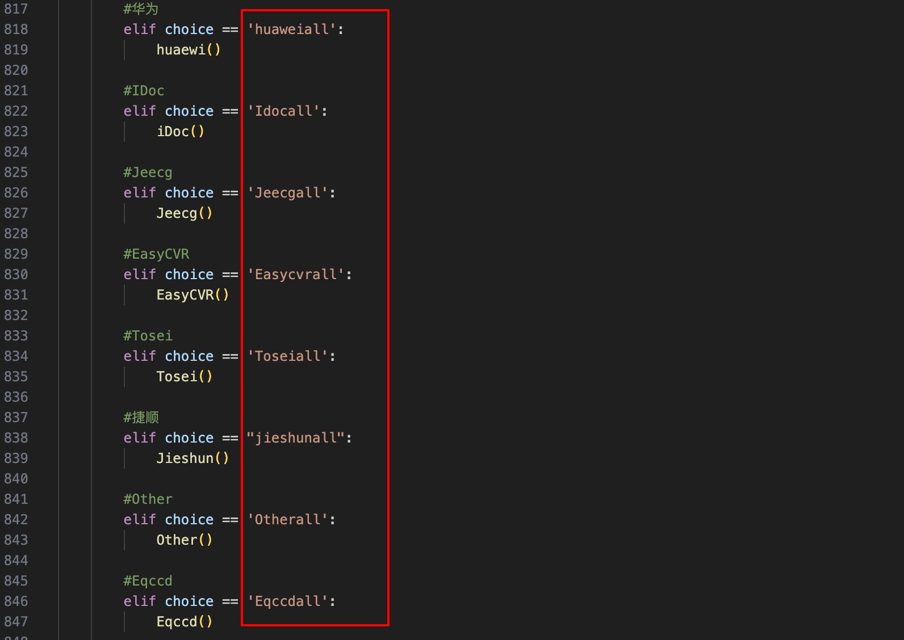

# FNScan2023

郑重声明：文中所涉及的技术、思路和工具仅供以安全为目的的学习交流使用，任何人不得将其用于非法用途以及盈利等目的，否则后果自行承担。


使用方法：

```
python3 FNscan.py
提示：Please choose the operation you want to perform >>>    [这里输入你想扫描漏洞的类型]
提示：Please enter the number of threads  >>>  [这里输入你的线程]
```

扫描类型输入什么呢？

```
请看FNscan.py
第672行到846行的内容
太多了不想写
```



每一个都代表着里面有该产品的n个漏洞poc

线程会输入吧

```
只能输入数字，没做错误处理，输入错了还得重新再来哈
```


测试目标以什么格式放在哪里呢？

```
测试目标以http或https开头的url
eg:
http://www.123xxxx.com/  [✅]
https://www.123xxxx.com/ [✅]
http://www.122xxxxx.com/login.html [❌]
放入url.txt中即可
```


那么扫描的结果会放在哪里呢？

```
当前目录下的reps文件夹中，会以漏洞名称-时间来命名，如xxxSql-2023-11-30
```


如你所见这个脚本的代码量有点大了，冗余的地方貌似有点多了，哈哈哈，学的不好给2023做个结尾吧，后续会努力学习写一个好用的脚本。😄


还有个重要的事情

关于该脚本中会用到什么python库作者也不知道了(写完就忘了，太多也不想看了哈哈哈哈哈哈)，但也不多，麻烦手动安装一下吧


后续使用中有什么问题 提 `Issues` 就好啦
